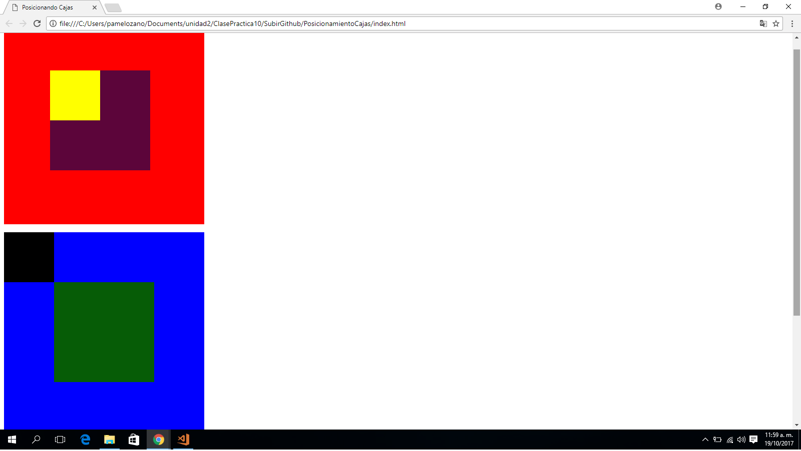

## POSICIONANDO CAJAS

### POSITION ABSOLUTE & RELATIVE
Este repositorio contiene un proyecto (Posicionando Cajas por bloques) trabajado con  __**(position absolute y relative)**__ para poder alterar las posiciones de cada elemento.

### Pondremos en práctica lo siguiente:
1. Aplicaremos **selectores:**
    * Selector elemento: div
    * Selector de clases: atributo **class**

2. Aplicaremos __"elementos que componen el modelo de caja"__
    * Padding **(relleno)**.
    * Margin **(margen)**

3. Aplicaremos la __"propiedad de los elementos de caja""__
    * display **(por bloques)**
    * background-color **(Color al bloque)**
    * width **(Ancho de la caja)**
    * height **(Alto de la caja)**

4. Aplicaremos __"Propiedad Positioning"__ definir que efectos realizar.
    * absolute **(para poder definir su posicion segun la estructura del HTML)**
    * relative **(para poder superponer a otros elementos)**

5. Aplicaremos __*Propiedades de position absolute*__ para posicionar las cajas.
    * top   **(parte superior)**
    * left  **(parte izquierda)**
    * bottom **(parte inferior)**}

### Herramientas Utilizadas:
1. HTML
2. CSS3

### Imagen final:
